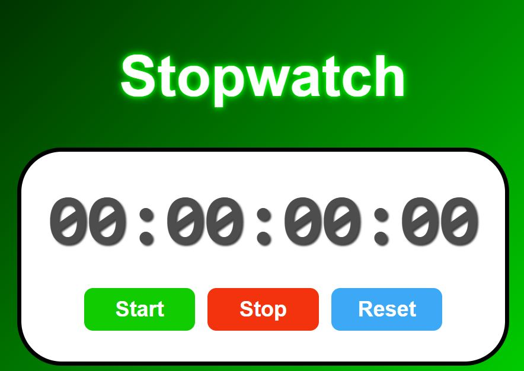

# ⏱️ Stopwatch App  
A sleek and accurate stopwatch app built with HTML, CSS, and JavaScript. This app tracks elapsed time down to the centisecond (1/100th of a second) and includes essential control buttons: Start, Stop, and Reset.

👉 [Live Demo](https://zunaid990.github.io/Stopwatch-app/)

---

## How It's Made:

**Tech used:** HTML, CSS, JavaScript

This stopwatch is a browser-based app that uses:
- **HTML** to structure the layout
- **CSS** for custom styles, transitions, and a modern glassmorphism-inspired UI
- **JavaScript** to manage timing logic and user interaction

**Main Features:**
- Tracks hours, minutes, seconds, and milliseconds
- Start, Stop, and Reset functionality
- Uses `setInterval()` for real-time tracking
- Stylish buttons with hover effects
- Fully responsive layout

---

## Optimizations:

- Used `padStart()` to format time units consistently
- Optimized DOM access with a single `display` reference
- Managed time calculation using `Date.now()` for accurate results
- Added transitions for smoother UI feedback
- Lightweight and dependency-free

---

## Lessons Learned:

This project gave me deeper insight into working with real-time functions like `setInterval()` and `clearInterval()`. I also improved my skills in formatting time data and applying CSS transitions for a better user experience. Handling stopwatch logic helped me better understand JavaScript timing functions and how to manage app state effectively.

---

## 🔗 Other Projects:

- [🧮 Calculator App](https://github.com/Zunaid990/calculator-app.git) – A basic calculator built with HTML, CSS, and JavaScript.
- [🃏 Card Battle Game](https://github.com/Zunaid990/zunaids-card-battle.git) – A fun two-player game using the Deck of Cards API.
